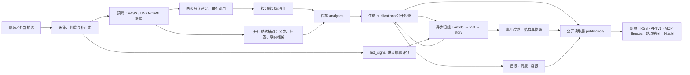

# 当前架构：AIHOT 开源基座

本文描述当前仓库已有的实现，供后续基于 AIHOT 开发 AI Radar 时定位模块与数据边界；不表示两个项目已完成融合。数据源、评分、精选、事件与成刊的逐项差异见 [AIHOT 与 AI Radar 对比](references/ai-radar-comparison.md)，后续开发方向见 [开发导览](development.md)。这里的模型与信源能力均指仓库实现，不推断任一网站当前线上的配置。



## 三个进程

| 进程 | 位置 | 做什么 |
|---|---|---|
| api | [apps/api/](../apps/api/) | Fastify。网站自用接口（`/api/site/`）、公开 API（`/api/v1/`）、RSS、MCP、后台接口、图片代理、分享图 |
| worker | [apps/worker/](../apps/worker/) | pg-boss 任务队列和定时任务：抓信源、调模型、归组、热度、日报、告警、清理 |
| web | [apps/web/](../apps/web/) | React Router 服务端渲染的网页。只通过 HTTP 读 api，不碰数据库 |

业务代码在 [packages/backend/](../packages/backend/)，前后端共用类型和常量在 [packages/contracts/](../packages/contracts/)，行业定义在 [industry/](../industry/)。PostgreSQL 同时保存业务数据与 pg-boss 队列状态；Node.js 24 直接运行后端 TypeScript，网页有独立构建步骤。API 接收采集推送或后台操作后交给后端入库、排队，读者请求不承担生成工作。

## 业务阶段与调用边界

按业务职责可以拆成七个主环节，结构抽取是评分旁边的并行支路。阶段数是阅读口径，并非七个独立服务或七个模型请求；实际编排由 [jobs/content.ts](../packages/backend/src/jobs/content.ts)、[jobs/events.ts](../packages/backend/src/jobs/events.ts) 和 [worker 定时表](../apps/worker/src/schedules.ts) 完成。

| 环节 | 输入、决策与产物 | 代码入口 |
|---|---|---|
| 1. 采集、判重与补正文 | 各适配器与外部推送汇入统一材料入口，确定文章身份、修订和时间线；必要时先抓正文，正文获取失败有重试及 `unconfirmed` 状态 | [sources/collect.ts](../packages/backend/src/sources/collect.ts)、[content/materials.ts](../packages/backend/src/content/materials.ts)、[content/extract.ts](../packages/backend/src/content/extract.ts) |
| 2. 预筛 | 判断是否属于行业；仅 `BLOCK` 停止，`UNKNOWN` 继续。材料不足时得到的 `BLOCK` 会降为 `UNKNOWN` | [editorial/analyze.ts](../packages/backend/src/editorial/analyze.ts) 的 `runPrefilter` |
| 3. 两次评分＋并行结构抽取 | 同一评分标准独立调用两次，以来源等级门槛决定入选；两次评分串行，结构抽取与它们并行。结构产出分类、标签、主体公司与事实框架，不负责读者文案 | [editorial/analyze.ts](../packages/backend/src/editorial/analyze.ts) 的 `runScores`、`runStructure`、`runAnalysis` |
| 4. 按分数分流写作 | 入选与接近入选内容走理解式写作，其余走较轻的标题摘要路径；短 X 帖有保留原文或翻译分支。汇总后保存分析结果，并生成公开投影 | [editorial/writing.ts](../packages/backend/src/editorial/writing.ts)、[publication/publish.ts](../packages/backend/src/publication/publish.ts) |
| 5. 事件归组 | 召回近两周报道，再判断同次发生、直接后续进展或无关；把文章挂到事实，事实再归入事件。模糊合并有复核，人工归属不被自动重算覆盖 | [events/group.ts](../packages/backend/src/events/group.ts)、[events/relate.ts](../packages/backend/src/events/relate.ts) |
| 6. 事件热度与综述 | 归组形成参与者信号；按事件计算热度及趋势，另生成事件综述。这是独立任务，不是给文章评分再排序 | [events/hot.ts](../packages/backend/src/events/hot.ts)、[events/digest.ts](../packages/backend/src/events/digest.ts) |
| 7. 成刊 | 从已公开的精选候选中按事实去重，再生成日报导语与看点、周报和月报；刊物与修订落库，前端读取已存结果 | [reports/compose.ts](../packages/backend/src/reports/compose.ts) |

这条链有分支：没有评分门槛的来源等级不参与精选评分；`hot_signal` 来源跳过编辑分析，只作为符合条件的事件讨论证据；`isolated` 来源不进入公开出口。历史材料可分析并归档，但不会像实时报道那样新建事件或触发精选推送。来源角色见 [信源](sources.md)，具体评分、门槛及校准见 [精选与校准](selection.md)。

处理终态还执行[内容保留规则](operations/content-retention.md)：公众号保留，非微信已过滤内容清除业务正文及回填准备副本，留下去重和账务关联占位。`content/retention.ts` 是共同执行入口；热度未匹配内容沿用既有等待窗口，由每日 retention 收尾。付费回执响应和原始离线归档独立保留。

分析完成不等于所有派生产物同时完成。`processArticle` 先更新公开投影，再投递归组；首次入选会等待归组完成或可见性延迟到期，归组后再更新投影中的事实和事件归属。全文翻译、事件综述、热度和刊物各有自己的任务与刷新时点，因此诊断时应检查相应产物，而不能只看文章的 `processing_state`。

## 核心数据与状态

历史批次入口为 `scripts/backfill.ts`，状态保存在 `backfill_runs` / `backfill_items`。一次性 RADAR 转换器输出原生材料和绑定内容 hash 的完整性证据；受管历史经独立执行上下文调用现有五角色编辑链和 publication，以个人 Gateway 的固定 self_hosted 路由处理，预算服务为 `backfill`。普通队列、原文提取和全文翻译跳过受管条目，实时模型配置不受影响。管理员通过 `/admin/backfill` 查看逐日进度并暂停或准备续跑；有界执行命令负责实际运行。操作见[历史回填](operations/backfill.md)，决定与未验证边界见[实现决定](references/20261001-backfill-design.md)。

三个核心概念分别回答不同问题：`article` 是一份来源材料，`fact` 是一次现实发生，`story` 是这次发生及其直接后续。多家媒体报道同一次发布可以共享一个 `fact`；同一事件的后续进展可以形成新的 `fact` 并挂在同一个 `story` 下。模型抽出的事实框架是归组输入，不等于已经创建的 `facts` 记录。

| 持久对象 | 写入与变换 | 主要消费者 |
|---|---|---|
| `sources`、`fetch_runs` | 来源定义、角色、抓取进度与记录；示范配置导入后由数据库承载运行态 | 采集调度、后台、来源健康与热度完整性检查 |
| `articles`、`article_revisions`、`article_discoveries` | 原始材料、正文、来源时间、发现时间及修订；所有材料入口共用身份与时间线规则 | 正文提取、分析、归组、详情与诊断 |
| `analyses`、`translations` | 按输入修订保存分析输出及所用回执；全文翻译另存 | 公开投影、归组、正文呈现、后台诊断 |
| `editorial_overrides`、`grouping_overrides` | 人工修正文案／精选／可见性，或指定归属 | 重建公开投影和归组时保留人工意图 |
| `publications`、`selected_state`、`selected_ledger` | 汇合材料、最新分析、人工修改和归属，保存读者可见投影；记录精选集合的增改撤回 | 网站、RSS、公开 API、MCP；增量同步消费者读取 ledger |
| `facts`、`fact_articles`、`stories` | 文章与事实关联、事实与事件关联；报道角色区分主报道、报道和提及 | 阅读分组、事件详情、成刊去重 |
| `story_signals`、`hot_rankings`、`story_heat_hourly`、`story_digests` | 事件参与信号、热榜与小时快照、事件综述 | 热点页、事件页、趋势展示 |
| `reports`、`report_revisions` | 日报／周报／月报内容及重新生成时的修订 | 刊物页面、日报 RSS 与公开查询 |
| `receipts`、`receipt_attempts`、`budgets` | 付费逻辑请求、实际尝试及请求次数上限 | 请求复用、恢复、预算检查与后台运行记录 |

初始 schema 分布在 [0001_core.sql](../database/migrations/0001_core.sql) 和 [0002_events_reports.sql](../database/migrations/0002_events_reports.sql)，当前结构还要顺序叠加 [后续迁移](../database/migrations/)；例如 attempts、人工归组与重归组等待状态分别由后续迁移引入，不能只按初始建表文件理解运行库。

状态排查从 [queueProcessing / processArticle](../packages/backend/src/jobs/content.ts) 开始：正文使用 `body_status`，分析使用 `processing_state`、重试次数和下次重试时间，公开可见性使用 `publications` 的资格、精选和延迟字段，归组另看关联表与 `grouped_at`。定时 sweep 会补排到期或遗漏的内容任务；失败与未知付费回执不是正常的“未入选”结果。

## 几条不变的规则

- **一个公开读取层**：网页、RSS、API、MCP、站点地图、分享图读的都是 `packages/backend/src/publication/`，所以各个出口看到的内容一致。新增公开出口也从这里读。
- **页面不调模型**：读者打开页面只读数据库里已经有的结果；模型只在 worker 的任务里调用。
- **花钱的请求有回执**：[providers/receipts.ts](../packages/backend/src/providers/receipts.ts) 在发送前记录逻辑请求与 attempt，原始响应先保存再进入业务写入。已收到的结果可复用。Gateway 明确的整请求冷却拒绝进入有界退避，其他未知结果必须核账，不按时间自动放行；历史直连请求仍保留超过 30 分钟自动放行一次的规则。核账恢复将回执、对应任务和审计一起提交，保留旧 attempt、费用及原分析标识。操作见[生产运维](operations/production.md#gateway-未知回执核对)。
- **预算熔断**：按服务对实际 attempts 检查每分钟、每小时、每天的请求次数上限，超限暂停；它不是按美元金额计算的预算。后台“设置 → 预算”维护这些配置。
- **安全阀**：`COLLECT_ENABLED`、`MODEL_CALLS_ENABLED`、`FEISHU_CONTENT_PUSH_ENABLED`、`FEISHU_INTERNAL_ENABLED`、`INDEXNOW_SUBMIT_ENABLED` 只决定“发不发出去”，不决定走哪套逻辑。开发和测试时关掉。
- **公开内容匿名**：管理员和访客看到的一样；读者的收藏、已读存在浏览器里。后台只允许管理员。
- **旧文不刷屏**：发现时已发布超过 48 小时的资料、新信源的存量、回灌的推送，按原文时间归档，不进“今天”、不推送。
- **来源可追溯**：每条公开新闻详情都在阅读栏顶部提供“阅读原文”，所有来源共用 `ItemPage` 和 `links.original`，手机工具栏与桌面侧栏使用相同文案。没有可显示的正文时提示前往来源网站，不以 `readingMode="full"` 推断正文存在。站内是否显示全文由信源的 `site_fulltext` 等发布条件决定，默认只显示摘要。

## 行业包与实现的边界

[industry/](../industry/) 提供站名品牌、分类与主题、示范来源、prompt、入选门槛及 AI 专属模块开关。它适合承载 AI Radar 的行业内容与选择标准；队列、归组、热度、公开读取和支付恢复等运行机制仍在后端。更换行业包不会自动把另一套项目的选择器或事件算法接进来。

模型由 [editorial/models.ts](../packages/backend/src/editorial/models.ts) 按能力选择，支持后台配置、环境变量与代码默认值；实际部署可覆盖仓库默认值。改模型路由看这里，改送给模型的材料看 [editorial/input.ts](../packages/backend/src/editorial/input.ts)，改标准看 [industry/prompts/](../industry/prompts/)，改评分合成或任务关系看 `analyze.ts` 与 `jobs/`。改任一公开出口的内容资格，应先查 [publication/rules.ts](../packages/backend/src/publication/rules.ts) 和 `publish.ts`，避免各渠道各自定义精选。

## 目录

| 位置 | 内容 |
|---|---|
| [industry/](../industry/) | 行业包：站名文案、分类标签、主题、示范信源、提示词、门槛、品牌、条款页 |
| [sources/](../packages/backend/src/sources/) | 六种信源的读取器，抓取调度（`collect.ts`） |
| [content/](../packages/backend/src/content/) | 资料入库、判重、正文提取和清洗 |
| [editorial/](../packages/backend/src/editorial/) | 判断与写作：`analyze.ts`（流程）、`prompts.ts`（读提示词）、`models.ts`（每一步用哪个模型） |
| [jobs/](../packages/backend/src/jobs/) | 队列名、排队、并发、处理失败与恢复；worker 注册这些任务 |
| [events/](../packages/backend/src/events/) | 事件归组、热度、事件综述 |
| [publication/](../packages/backend/src/publication/) | 公开投影、公开资格规则及读取层 |
| [reports/](../packages/backend/src/reports/) | 日报、周报、月报 |
| [providers/](../packages/backend/src/providers/) | 模型、向量、X、公众号、Jina 的调用，回执与预算 |
| [notify/](../packages/backend/src/notify/) | 飞书推送 |
| [operations/](../packages/backend/src/operations/) | 告警、备份、清理、IndexNow |
| [admin/](../packages/backend/src/admin/) | 后台接口 |
| [leaderboard/](../packages/backend/src/leaderboard/)、[monitor/](../packages/backend/src/monitor/) | 模型榜、Codex 重置监控（见 [模型榜与 Codex 重置监控](leaderboard.md)） |
| [apps/web/app/routes/](../apps/web/app/routes/) | 每个页面一个文件，[routes.ts](../apps/web/app/routes.ts) 是路由表 |
| [database/migrations/](../database/migrations/) | 数据库迁移，按编号顺序执行 |
| [scripts/](../scripts/) | 初始化、迁移、种子数据、评测、检查脚本 |
| [tests/](../tests/) | 后端测试（需要一个名字以 `_test` 或 `_ci` 结尾的空库） |

## 对外出口

| 地址 | 内容 |
|---|---|
| `/` `/all` `/hot` `/topics` `/daily` `/weekly` `/monthly` | 精选、全部动态、热门事件、主题、日报周报月报 |
| `/feed.xml` `/feed/all.xml` `/feed/full.xml` `/feed/daily.xml` | RSS：精选、全部、全文、日报 |
| `/api/v1/` | 公开 API，文档在 `/openapi-v1.json`，说明页在 `/agent` |
| `/api/mcp` | MCP 服务，工具名前缀是 `industry/site.ts` 的 `mcpPrefix` |
| `/llms.txt` `/sitemap.xml` `/robots.txt` | 给大模型和搜索引擎的说明 |
| `/admin` | 后台 |

## 测试

```bash
npm run typecheck
createdb myhot_test
DATABASE_URL=postgres://127.0.0.1:5432/myhot_test node scripts/migrate.ts
DATABASE_URL=postgres://127.0.0.1:5432/myhot_test npm test
npm run build -w @aihot/web && node --test apps/web/tests/*.test.ts
```

测试不访问任何外部服务：模型和付费接口都由本地假服务回答。
